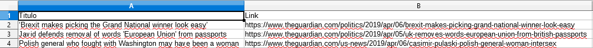
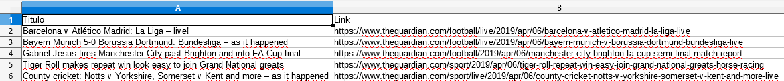

# news-theguardian


>Um script modularizado para buscar as ultimas, através da API do jornal The Guardian, as últimas notícias e exportar para CSV os títulos e links de algumas categorias.
>

- News
- Sports
- Arts

### Bibliotecas para funcionamento do script
```sh
pip install requests
pip install json
pip install pandas
```

### Funções
```sh
main()
consultar_api()
menu(dados)
buscar_noticias(dados)
buscar_sport(dados)
buscar_news(dados)
buscar_arts(dados)
```

### Execução
```sh
$ git clone https://https://github.com/tmtic/news-theguardian.git
.git
$ cd news-guardian
$ python -m pip install --upgrade requests
$ python -m pip install --upgrade pandas
$ python theguardian.py
```

### Comandos do GIT
```sh
$ git status
$ git add .
$ git commit -m "texto"
$ git pull --rebase oring master
$ git push origin master
```

### Arquivo gerado






### Desenvolvedor

 - Thiago Muniz

License
----
*Free Software!* A documentação está atualmente armazenada [aqui](https://github.com/tmtic/news-theguardian.git)